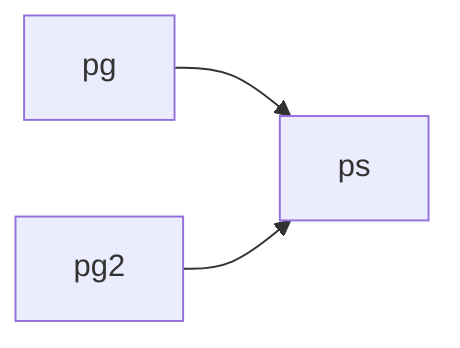

# Basic Network Simulations and Beyond in Python
https://www.grotto-networking.com/DiscreteEventPython.html

ネットワークシミュレーションに用いる基本コンポーネントを提供
[SimComponents.py](https://www.grotto-networking.com/files/DESPython/SimComponents.py)

- Packet
  - パケットを表す単純なデータ オブジェクト
  - 通常、PacketGeneratorによって作成される
  - 主要なフィールドには、生成時刻、サイズ、flow_id、パケット ID、送信元、および宛先が含まれる
  - 上位層プロトコルはモデル化しない、つまり、パケットにペイロードが含まれていない
  - サイズ (バイト単位) フィールドを用いて、送信時間を決定する
- PacketGenerator
  - PacketGeneratorは、指定された到着間隔時間分布とパケットサイズの分布を持つ、パケットの送信をシミュレートする
  - パケット生成の初期遅延と終了時間を設定できる
  - さらに、生成されたパケットの送信元IDとフローIDを設定できる
  - PacketGeneratorの`out`メンバー変数を用いて、ジェネレータと任意のコンポーネントを、put() メンバー関数によって接続する。
- PacketSink
  - PacketSinkは、パケットからの到着時刻情報を記録する
  - これは、生の到着時間または到着間隔の形式をとる
  - さらに、PacketSinkはパケットの待ち時間を記録できる
  - put()操作をサポートする
- SwitchPort
  - パケットスイッチ/ルータの先入れ先出し(FIFO)キュー出力ポートをモデル化する
  - 出力ポートのレートとキュー サイズの制限 (バイト単位) を設定できる
  - 受信したパケットやドロップしたパケットを追跡する
- PortMonitor
  - PortMonitorは、SwitchPort のキューサイズを経時的にモニタする場合に使用される
  - サンプル分布、つまり連続したサンプルの間隔の時間を与える分布、を指定する必要がある

## Two Packet Generators and a Sink

```python
from random import expovariate
import simpy
from SimComponents import PacketGenerator, PacketSink

def constArrival():  # Constant arrival distribution for generator 1
return 1.5

def constArrival2():
return 2.0

def distSize():
return expovariate(0.01) # Note: 平均値の逆数が0.01-> 平均値が100の指数分布

env = simpy.Environment()  # Create the SimPy environment
# Create the packet generators and sink
ps = PacketSink(env, debug=True)  # debugging enable for simple output
pg = PacketGenerator(env, "EE283", constArrival, distSize)
pg2 = PacketGenerator(env, "SJSU", constArrival2, distSize)
# Wire packet generators and sink together
pg.out = ps
pg2.out = ps
env.run(until=20)
```

## SimComponents.py 解析
素直な実装

### SwitchPort
#### コンストラクタ
- simpy.Store(env): FIFO的なリソース
```python
class SwitchPort(object):
    """ Models a switch output port with a given rate and buffer size limit in bytes.
        Set the "out" member variable to the entity to receive the packet.

        Parameters
        ----------
        env : simpy.Environment
            the simulation environment
        rate : float
            the bit rate of the port
        qlimit : integer (or None)
            a buffer size limit in bytes or packets for the queue (including items
            in service).
        limit_bytes : If true, the queue limit will be based on bytes if false the
            queue limit will be based on packets.

    """
    def __init__(self, env, rate, qlimit=None, limit_bytes=True, debug=False):
        self.store = simpy.Store(env)
        self.rate = rate
        self.env = env
        self.out = None
        self.packets_rec = 0
        self.packets_drop = 0
        self.qlimit = qlimit
        self.limit_bytes = limit_bytes
        self.byte_size = 0  # Current size of the queue in bytes
        self.debug = debug
        self.busy = 0  # Used to track if a packet is currently being sent
        self.action = env.process(self.run())  # starts the run() method as a SimPy process
```

#### run()
- 動作
  - store からメッセージを取り出す
  - busy=1 : PortMonitorで使う。キューのサイズと、この処理中のパケットを加算している
  - サイズを減算する
  - メッセージバイトサイズを8倍してビットサイズにしてレートで割った時間 wait
  - メッセージを出力
  - busy=0
```python
    def run(self):
        while True:
            msg = (yield self.store.get())
            self.busy = 1
            self.byte_size -= msg.size
            yield self.env.timeout(msg.size*8.0/self.rate)
            self.out.put(msg)
            self.busy = 0
            if self.debug:
                print(msg)
```

#### put()
- 動作
  - キューのサイズ制限がないときは、storeにput()
  - バイト制限に引っかかる時はdrop (Note: `pkt`すててないな)
  - キューサイズ制限に引っかかる時はdrop (pktすててない)
  - put()
```python
    def put(self, pkt):
        self.packets_rec += 1
        tmp_byte_count = self.byte_size + pkt.size

        if self.qlimit is None:
            self.byte_size = tmp_byte_count
            return self.store.put(pkt)
        if self.limit_bytes and tmp_byte_count >= self.qlimit:
            self.packets_drop += 1
            return
        elif not self.limit_bytes and len(self.store.items) >= self.qlimit-1:
            self.packets_drop += 1
        else:
            self.byte_size = tmp_byte_count
            return self.store.put(pkt)

```

### RandomBrancher
乱数で出力先を決定?

### FlowDemux
flow_idに従って出力を決定する。スイッチに使えそう。

### TrTCM
Two rate three color marker (green, yellow, red)

### SnoopSplitter
スヌーピング (パケットのコピーを別ポートに送る)

### StampedStorePut
あとまわし

### StampedStore
あとまわし
### ShaperTokenBucket
トークンバケットシェイパー

### VirtualClockServer
### WFQServer
weighted fair queue?
