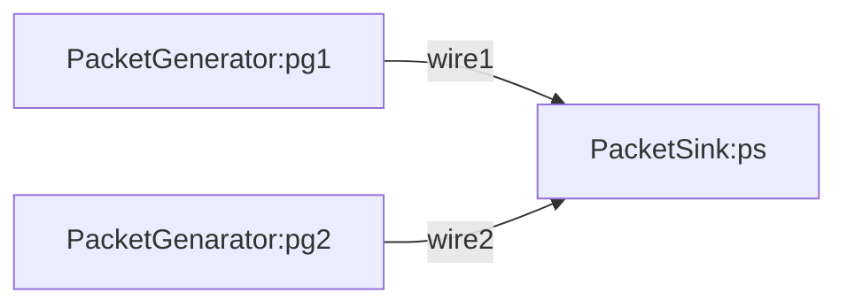

# examples

## basic.py



## tcp.py
 ```mermaid
 flowchart

sender[TCPPacketGeneraotr:sender]
switch[SimplePacketSwitch:switch]
receiver[TCPSink:receiver]

sender -->|wire1_downstream| switch
switch -->|wire1_upstream| sender
switch -->|wire2_downstream| receiver
receiver -->|wire2_upstream| switch
```
スイッチの転送設定は以下のようになっている。
```
fib = {0: 0, 10000: 1} 
```
- flow_id:0 => port0 (=> wire2_downstream)
- flow_id:10000 => port 1(=> wire1_upstream)
- Note: TCPSinkが受信したパケットのfid+10000をACKとして返してくる